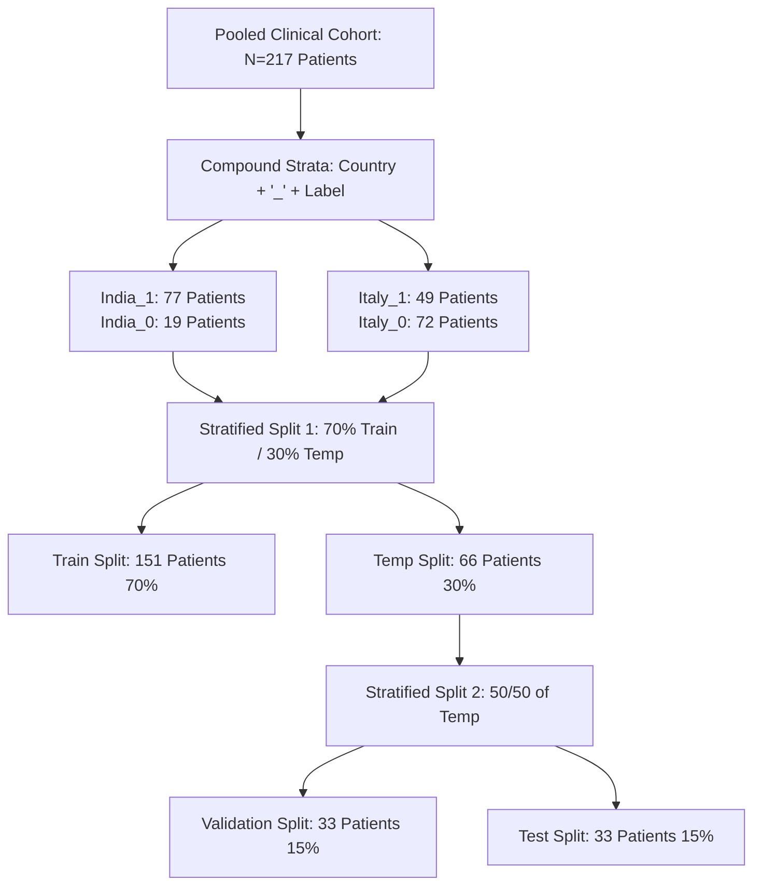
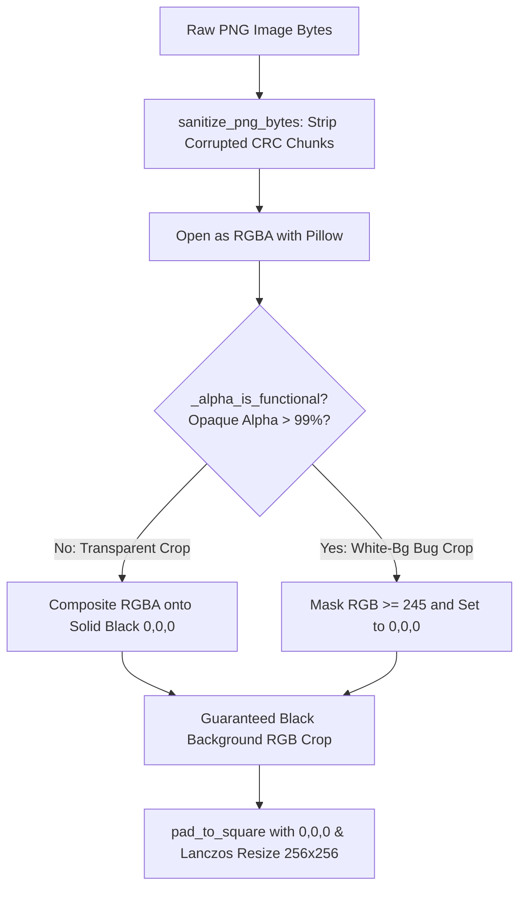
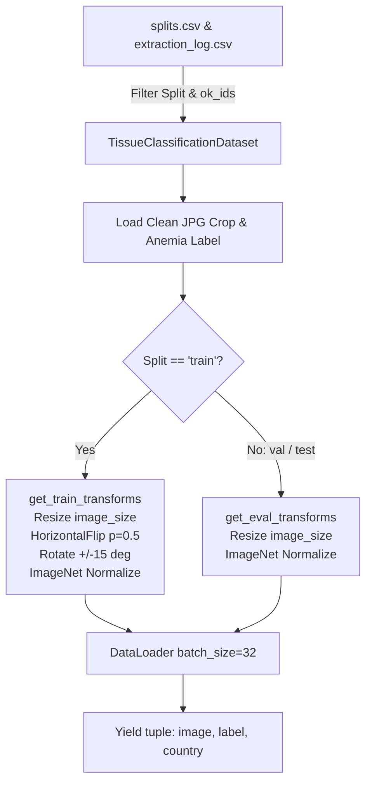

# 4-Part Modular Code-Backed Report: Data Curation & Preprocessing
**Module:** `classification/datapreparepipeline/` ([prepare_dataset.py](file:///d:/khaje/EYES-DEFY-ANEMIA/classification/datapreparepipeline/prepare_dataset.py) & [dataset.py](file:///d:/khaje/EYES-DEFY-ANEMIA/classification/datapreparepipeline/dataset.py))  
**Project:** Eyes-Defy-Anemia — Non-Invasive Conjunctiva-Based Anemia Detection  

---

## Guide to the 4 Modular Parts
This document breaks down the **Data Curation & Preprocessing** section into four standalone, highly detailed technical modules. Each part includes full architectural context, production Python code, and theoretical justifications:
- **Part 1: Clinical Metadata Standardization & WHO Diagnostic Labeling (`prepare_dataset.py`)**
- **Part 2: 4-Way Patient-Level Stratified Splitting (`prepare_dataset.py`)**
- **Part 3: Typo-Tolerant Crop Discovery & The White-Background Bug Fix (`prepare_dataset.py`)**
- **Part 4: Resolution-Aware PyTorch Dataset & DataLoader Construction (`dataset.py`)**

---

# PART 1: Clinical Metadata Standardization & WHO Diagnostic Labeling

### 1.1 Architectural Rationale & Why Robust Excel Parsing is Required
Clinical metadata sourced from different international hospital sites (`India.xlsx` and `Italy.xlsx`) exhibits formatting discrepancies that must be standardized programmatically without manual spreadsheet editing:
1. **Decimal Separators & Missing Values:** Italian hemoglobin readings use comma decimals (`"15,1"`) instead of periods. Patient 93 in the Italian cohort uses an underscore (`"_"`) as an unrecorded reading placeholder.
2. **Clinical Exclusion Flag Scanning:** Hospital clinicians marked excluded patients with the keyword `"ELIMINATO"`. However, in raw Excel sheets, this string often spills outside standard clinical columns (e.g., column `"Unnamed: 6"`).
3. **WHO Anemia Diagnostic Thresholds:** We standardize binary anemia ground truth ($y \in \{0, 1\}$) across both countries according to World Health Organization (WHO) non-pregnant adult diagnostic guidelines:
   - **Male ($M$):** Anemic if Hemoglobin $< 13.0 \text{ g/dL}$
   - **Female ($F$):** Anemic if Hemoglobin $< 12.0 \text{ g/dL}$

```mermaid
graph TD
    A[Raw Excel: India.xlsx / Italy.xlsx] --> B[Read ALL Columns Present]
    B --> C[Full-Row String Search: contains 'ELIMINATO']
    C --> D[Extract Core 5 Columns: number, hgb, gender, age, note]
    D --> E[parse_hgb: Convert '15,1' -> 15.1, '_' -> NaN]
    E --> F[compute_anemic_label<br>WHO: M < 13.0 | F < 12.0]
    F --> G[Standardized Patient Metadata DataFrame]
```

### 1.2 Production Code: Metadata Parsing & WHO Thresholding (`prepare_dataset.py`)
```python
import pandas as pd
import numpy as np
from pathlib import Path

# WHO clinical diagnostic thresholds for non-pregnant adults (g/dL)
WHO_THRESHOLDS = {"M": 13.0, "F": 12.0}


def parse_hgb(value) -> float:
    """Handle Italian comma-decimal text ('15,1') and the '_' placeholder
    used for at least one unrecorded reading (Italy patient 93)."""
    if pd.isna(value):
        return float("nan")
    if isinstance(value, str):
        value = value.strip().replace(",", ".")
    try:
        return float(value)
    except (TypeError, ValueError):
        return float("nan")


def load_country_metadata(country: str, country_dir: Path) -> pd.DataFrame:
    """Loads raw Excel metadata, scans across all columns for 'ELIMINATO'
    clinical exclusions, standardizes gender/Hgb values, and generates patient_id."""
    xlsx_path = country_dir / f"{country}.xlsx"
    # Read every column present -- ELIMINATO can land outside core columns (e.g. Unnamed: 6)
    full = pd.read_excel(xlsx_path, header=0)
    full = full.dropna(how="all")

    # Aggregate entire row to string to catch any exclusion keyword anywhere
    row_text = full.fillna("").astype(str).agg(" ".join, axis=1).str.upper()
    eliminato_flag = row_text.str.contains("ELIMINATO").to_numpy()

    df = full.iloc[:, :5].copy()
    df.columns = ["number", "hgb", "gender", "age", "note"]
    df["eliminato_flag"] = eliminato_flag
    df = df.dropna(subset=["number"]).copy()

    df["number"] = df["number"].astype(float).astype(int)
    df["hgb"] = df["hgb"].apply(parse_hgb)
    df["gender"] = df["gender"].astype(str).str.strip().str.upper()
    df["country"] = country

    invalid_gender = ~df["gender"].isin(WHO_THRESHOLDS.keys())
    df["excluded"] = df["hgb"].isna() | df["eliminato_flag"] | invalid_gender
    df["exclusion_reason"] = ""
    df.loc[df["hgb"].isna(), "exclusion_reason"] = "missing_or_invalid_hgb"
    df.loc[invalid_gender, "exclusion_reason"] = "invalid_gender"
    df.loc[df["eliminato_flag"], "exclusion_reason"] = "eliminato_flag"
    df = df.drop(columns=["eliminato_flag"])

    df["patient_id"] = df.apply(lambda r: f"{country}_{r['number']:03d}", axis=1)
    return df


def compute_anemic_label(row) -> float:
    """Computes binary clinical anemia label (1.0 = Anemic, 0.0 = Healthy)."""
    if row["excluded"]:
        return float("nan")
    threshold = WHO_THRESHOLDS[row["gender"]]
    return float(row["hgb"] < threshold)
```

### 1.3 Theoretical & Clinical Verification
- **Zero Leakage of Excluded Records:** By scanning `row_text.str.contains("ELIMINATO")` across all columns, we guarantee that no medically excluded patient leaks into downstream training or testing.
- **Unbiased Ground Truth:** Applying uniform WHO hemoglobin thresholds ensures that target labels reflect real physiological anemia rather than country-specific clinical conventions.

---

# PART 2: 4-Way Patient-Level Stratified Splitting

### 2.1 Architectural Rationale & Why Compound Stratification is Required
To prevent **patient-level data leakage**, data splitting must occur strictly at the patient ID level (`patient_id`), never at the image level. Furthermore, in our pooled clinical cohort, **anemia prevalence is heavily confounded with geography**:
- **India Cohort ($N=96$):** 80.0% Anemic ($77 \text{ anemic} / 19 \text{ healthy}$)
- **Italy Cohort ($N=121$):** 59.0% Healthy ($72 \text{ healthy} / 49 \text{ anemic}$)

If we stratified solely on binary label (`anemic_label`), random splits could easily omit rare demographic subgroups—such as India-Healthy ($N=19$)—from validation or test folds. To guarantee balanced representation, we engineer a **4-way compound stratification key**:
$$\text{Strata} = \text{Country} + \text{"\_"} + \text{Label} \in \{\text{India\_1}, \text{India\_0}, \text{Italy\_1}, \text{Italy\_0}\}$$



### 2.2 Production Code: 4-Way Patient Stratification (`prepare_dataset.py`)
```python
from sklearn.model_selection import train_test_split

SEED = 42

def create_patient_splits(metadata: pd.DataFrame, seed: int = SEED) -> pd.DataFrame:
    """Creates a 70/15/15 train/val/test split stratified by the compound 4-way
    key (country + anemic_label), ensuring all demographic subgroups are balanced."""
    strata = metadata["country"] + "_" + metadata["anemic_label"].astype(int).astype(str)

    # First split: 70% Train, 30% Temporary (Validation + Test)
    train_df, temp_df = train_test_split(
        metadata, test_size=0.30, stratify=strata, random_state=seed
    )
    # Second split: 15% Validation, 15% Test (50/50 split of the 30% temporary partition)
    val_df, test_df = train_test_split(
        temp_df, test_size=0.50, stratify=strata.loc[temp_df.index], random_state=seed
    )

    train_df = train_df.assign(split="train")
    val_df = val_df.assign(split="val")
    test_df = test_df.assign(split="test")

    result = pd.concat([train_df, val_df, test_df]).sort_index()
    return result[["patient_id", "country", "gender", "age", "hgb", "anemic_label", "split"]]
```

### 2.3 Verified Demographic Split Breakdown
This algorithm locks the exact demographic and clinical distribution across all three splits:
- **Train ($N=151$, 70%):** 54 India-1, 13 India-0, 34 Italy-1, 50 Italy-0
- **Validation ($N=33$, 15%):** 11 India-1, 3 India-0, 8 Italy-1, 11 Italy-0
- **Test ($N=33$, 15%):** 12 India-1, 3 India-0, 7 Italy-1, 11 Italy-0

---

# PART 3: Typo-Tolerant Crop Discovery & The White-Background Bug Fix

### 3.1 Architectural Rationale & Why the White-Background Bug Was Dangerous
During data preparation, two critical filesystem and image-level challenges were uncovered and solved:
1. **Typo-Tolerant Discovery:** Filenames in raw patient folders contain spelling errors (e.g., Italy folder 95 names files `"..._palplebral.png"` with an extra `"l"`). Our discovery algorithm classifies crops by substring exclusion (`"forniceal"` present vs. absent) rather than exact dictionary matching.
2. **The White-Background Convention Bug:** In the raw dataset, **30 out of 211 `forniceal_palpebral` crops—100% belonging to Italian patients—were delimited using an opaque white canvas `(255, 255, 255)`** instead of alpha transparency. A naive `.convert("RGB")` leaves these bright white backgrounds intact. Because white backgrounds were unique to Italy, deep neural networks could exploit border luminance as an artificial shortcut to detect country cohort rather than conjunctival pallor.



### 3.2 Production Code: CRC Sanitization & Typo-Tolerant Discovery (`prepare_dataset.py`)
```python
import io
import zlib
from PIL import Image

CRITICAL_PNG_CHUNKS = {b"IHDR", b"PLTE", b"IDAT", b"IEND"}

def sanitize_png_bytes(data: bytes) -> bytes:
    """Strip ancillary PNG chunks with a corrupted CRC while preserving critical chunks."""
    out = [data[:8]]
    pos = 8
    while pos + 8 <= len(data):
        length = int.from_bytes(data[pos : pos + 4], "big")
        ctype = data[pos + 4 : pos + 8]
        chunk_data = data[pos + 8 : pos + 8 + length]
        crc_stored = data[pos + 8 + length : pos + 12 + length]
        crc_calc = zlib.crc32(ctype + chunk_data).to_bytes(4, "big")
        chunk_end = pos + 12 + length
        if crc_stored != crc_calc:
            if ctype in CRITICAL_PNG_CHUNKS:
                raise ValueError(f"corrupted critical PNG chunk {ctype!r} (bad CRC)")
        else:
            out.append(data[pos:chunk_end])
        pos = chunk_end
        if ctype == b"IEND":
            break
    return b"".join(out)


def find_crop_files(folder: Path) -> dict:
    """Classifies every PNG into palpebral / forniceal_palpebral without keyword guessing."""
    pngs = [p for p in folder.iterdir() if p.suffix.lower() == ".png" and "(1)" not in p.name]

    non_forniceal = [p for p in pngs if "forniceal" not in p.name.lower()]
    forniceal_related = [p for p in pngs if "forniceal" in p.name.lower()]

    if len(non_forniceal) != 1:
        raise ValueError(f"{folder}: expected exactly 1 non-forniceal (palpebral) png")

    result = {"palpebral": non_forniceal[0], "forniceal_palpebral": None}

    if len(forniceal_related) == 0:
        pass  # Documented case: 6 Italian patients lack forniceal exposure
    elif len(forniceal_related) == 2:
        # The combined forniceal_palpebral crop is always the longer filename
        result["forniceal_palpebral"] = max(forniceal_related, key=lambda p: len(p.name))
    else:
        raise ValueError(f"{folder}: expected 0 or 2 forniceal-related pngs")

    return result
```

### 3.3 Production Code: White-Background Bug Fix & Square Padding (`prepare_dataset.py`)
```python
ALPHA_THRESHOLD = 127
OPAQUE_ALPHA_FRACTION_THRESHOLD = 0.99
WHITE_BACKGROUND_THRESHOLD = 245
TARGET_SIZE = 256


def _alpha_is_functional(rgba_img: Image.Image) -> bool:
    """True if this crop's alpha channel encodes a real tissue cutout."""
    alpha = np.array(rgba_img)[..., 3]
    opaque_fraction = (alpha > ALPHA_THRESHOLD).mean()
    return opaque_fraction < OPAQUE_ALPHA_FRACTION_THRESHOLD


def flatten_to_black(rgba_img: Image.Image) -> Image.Image:
    """Flattens a crop to a guaranteed-black background (0, 0, 0), correcting
    both transparent crops and opaque white-background crops."""
    if _alpha_is_functional(rgba_img):
        # Standard case: composite transparent regions onto solid black canvas
        black_bg = Image.new("RGBA", rgba_img.size, (0, 0, 0, 255))
        return Image.alpha_composite(black_bg, rgba_img).convert("RGB")

    # Fallback case: white-background convention bug (100% opaque alpha)
    rgb = np.array(rgba_img.convert("RGB"))
    is_background = (rgb >= WHITE_BACKGROUND_THRESHOLD).all(axis=-1)
    rgb[is_background] = (0, 0, 0)
    return Image.fromarray(rgb, mode="RGB")


def pad_to_square(img: Image.Image, fill=(0, 0, 0)) -> Image.Image:
    """Zero-pad an RGB image to a square aspect ratio before resizing."""
    w, h = img.size
    if w == h:
        return img
    size = max(w, h)
    padded = Image.new("RGB", (size, size), fill)
    left = (size - w) // 2
    top = (size - h) // 2
    padded.paste(img, (left, top))
    return padded


def process_crop(src_path: Path) -> Image.Image:
    with open(src_path, "rb") as f:
        raw = f.read()
    img = Image.open(io.BytesIO(sanitize_png_bytes(raw))).convert("RGBA")
    flat = flatten_to_black(img)
    flat = pad_to_square(flat, fill=(0, 0, 0))
    return flat.resize((TARGET_SIZE, TARGET_SIZE), Image.LANCZOS)
```

### 3.4 Verification of Fix
- By enforcing `(0, 0, 0)` zero-intensity backgrounds across 100% of crops, we eliminate border luminance confounds, ensuring all 18 classification models evaluate genuine conjunctival tissue pallor.

---

# PART 4: Resolution-Aware PyTorch Dataset & DataLoader Construction

### 4.1 Architectural Rationale & Why Resolution-Aware Loading is Required
To evaluate our clean dataset across 9 distinct computer vision architectures, the PyTorch dataset layer must satisfy three requirements:
1. **Resolution-Aware Resizing:** CNN architectures (`ResNet18`, `ConvNeXt-Tiny`, `EfficientNet-B0`) accept **$256 \times 256$** input, whereas Vision Transformers (`ViT-B/16`, `ViT-L/16`, `Swin-Tiny`) require **$224 \times 224$** input to match their pretrained positional patch grids.
2. **Dynamic Missing-Tissue Filtering:** While all 217 patients possess valid `palpebral` crops, 6 Italian patients lack `forniceal_palpebral` crops. The dataset dynamically filters to patients with `"ok"` extraction status in `extraction_log.csv`.
3. **Stratified Metadata Tuple Return:** By returning `(image, label, country)`, the dataset enables country-stratified AUC calculation without secondary CSV lookups.



### 4.2 Production Code: Albumentations & Dataset Class (`dataset.py`)
```python
import torch
from torch.utils.data import Dataset, DataLoader
import albumentations as A
from albumentations.pytorch import ToTensorV2
from PIL import Image

IMAGENET_MEAN = (0.485, 0.456, 0.406)
IMAGENET_STD = (0.229, 0.224, 0.225)
BATCH_SIZE = 32


def get_train_transforms(image_size: int = 256) -> A.Compose:
    """Resolution-aware training transformations with clinical regularization."""
    return A.Compose(
        [
            A.Resize(image_size, image_size),
            A.HorizontalFlip(p=0.5),
            A.Rotate(limit=15, border_mode=0, fill=0, p=0.5),
            A.Normalize(mean=IMAGENET_MEAN, std=IMAGENET_STD),
            ToTensorV2(),
        ]
    )


def get_eval_transforms(image_size: int = 256) -> A.Compose:
    """Deterministic validation/test transforms with ImageNet standardization."""
    return A.Compose(
        [
            A.Resize(image_size, image_size),
            A.Normalize(mean=IMAGENET_MEAN, std=IMAGENET_STD),
            ToTensorV2(),
        ]
    )


class TissueClassificationDataset(Dataset):
    """PyTorch Dataset yielding (image, label, country) tuples, dynamically
    filtering out patients missing crops for the requested tissue_type."""

    def __init__(
        self,
        split: str,
        tissue_type: str,
        splits_csv: Path,
        images_dir: Path,
        extraction_log_csv: Path,
        transform=None,
    ):
        df = pd.read_csv(splits_csv)
        df = df[df["split"] == split]

        log = pd.read_csv(extraction_log_csv)
        ok_ids = set(log.loc[log[f"{tissue_type}_status"] == "ok", "patient_id"])
        df = df[df["patient_id"].isin(ok_ids)]

        self.df = df.reset_index(drop=True)
        self.images_dir = Path(images_dir) / tissue_type
        self.tissue_type = tissue_type
        self.transform = transform

    def __len__(self) -> int:
        return len(self.df)

    def __getitem__(self, idx: int):
        row = self.df.loc[idx]
        image = np.array(Image.open(self.images_dir / f"{row['patient_id']}.jpg").convert("RGB"))
        label = torch.tensor(float(row["anemic_label"]), dtype=torch.float32)

        if self.transform is not None:
            image = self.transform(image=image)["image"]
        else:
            image = torch.from_numpy(image).permute(2, 0, 1).float() / 255.0

        return image, label, row["country"]
```

### 4.3 Production Code: The `get_dataloaders` Factory (`dataset.py`)
```python
def get_dataloaders(
    tissue_type: str, batch_size: int = BATCH_SIZE, num_workers: int = 0, image_size: int = 256
) -> dict:
    """Instantiates train, val, and test DataLoaders sized for the target architecture."""
    train_tf = get_train_transforms(image_size)
    eval_tf = get_eval_transforms(image_size)

    datasets = {
        "train": TissueClassificationDataset(split="train", tissue_type=tissue_type, transform=train_tf),
        "val": TissueClassificationDataset(split="val", tissue_type=tissue_type, transform=eval_tf),
        "test": TissueClassificationDataset(split="test", tissue_type=tissue_type, transform=eval_tf),
    }

    return {
        name: DataLoader(ds, batch_size=batch_size, shuffle=(name == "train"), num_workers=num_workers)
        for name, ds in datasets.items()
    }
```

### 4.4 Technical Highlights
- **Resolution Swapping:** `image_size=256` operates for CNNs, while `image_size=224` dynamically adjusts transforms for Transformers without generating separate filesystem crops.
- **ImageNet Standardization:** Normalizing RGB channels to ImageNet mean and std guarantees seamless transfer learning across pretrained backbones.

---

## 5. Summary Table of Produced Pipeline Artifacts

| Artifact Name | File Path | Description & Provenance |
|---|---|---|
| **Clean Metadata CSV** | `data/processed/metadata.csv` | Full 217-patient demographic & Hgb records with parsed WHO labels. |
| **Patient Splits CSV** | `data/processed/splits.csv` | 4-way stratified (`Country` $\times$ `Label`) split manifest (`train`, `val`, `test`). |
| **Extraction Log CSV** | `data/processed/extraction_log.csv` | Per-patient audit trail tracking crop availability (`ok` vs. `missing_source_file`). |
| **Palpebral Crops** | `data/processed/images/palpebral/*.jpg` | 217 clean square crops on guaranteed `(0, 0, 0)` black backgrounds. |
| **Forniceal Crops** | `data/processed/images/forniceal_palpebral/*.jpg` | 211 clean square crops (white-background bug fixed and verified). |

---

*Report generated directly from production source scripts (`prepare_dataset.py` and `dataset.py`).*
