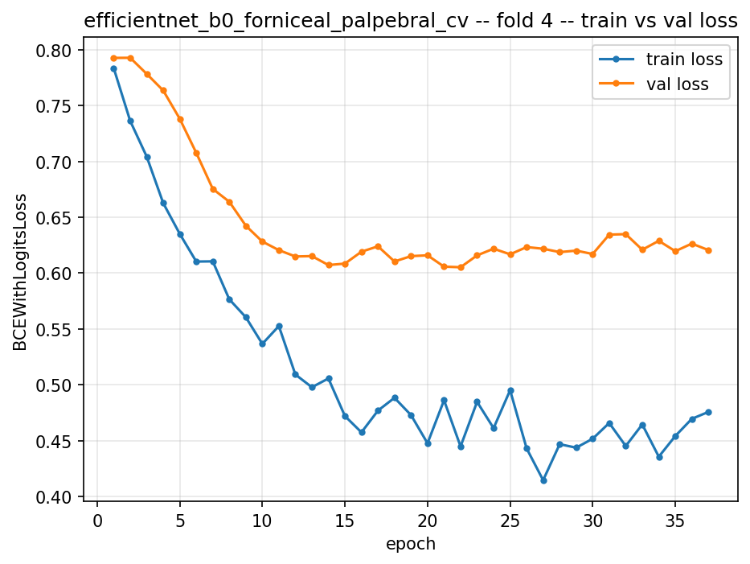
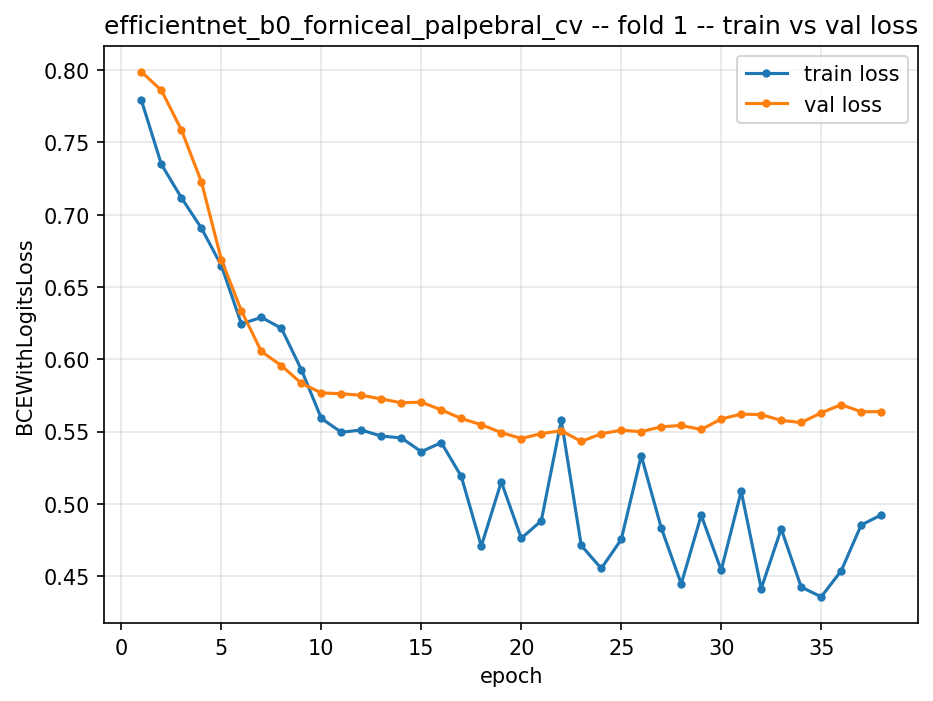
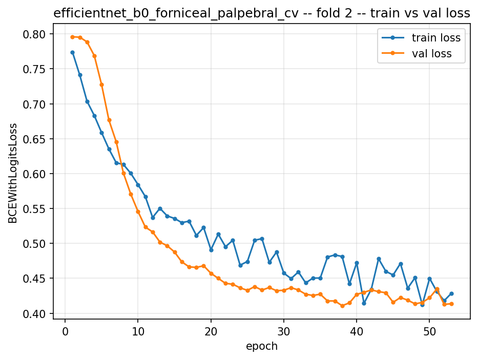

# EfficientNet-B0 (forniceal_palpebral) — 5-Fold Cross-Validation Analysis

**Generated:** 2026-08-01
**Model:** `efficientnet_b0_forniceal_palpebral_cv` — frozen ImageNet backbone, `Dropout(0.2) → Linear(1)` head
**Hyperparameters (locked, not re-tuned):** `learning_rate=8.2005e-04`, `weight_decay=1.9634e-06`, `dropout_rate=0.2` — inherited unchanged from Batch-1 Optuna trial #9 (`efficientnet_b0_forniceal_palpebral_v2`, single-split `best_val_f1=0.9333`)
**Protocol:** fresh random head init per fold (no warm-start), gradient clipping (`max_norm=1.0`), `ReduceLROnPlateau(factor=0.5, patience=5, min_lr=1e-6)`, `EarlyStopping(patience=15)` on validation loss, batch size 32, 150-epoch ceiling, 5 stratified folds (country × anemic-label) over a 178-patient CV pool (33-patient test set held out, never touched)
**Source data:** `classification/datapreparepipeline/efficientnet_b0_forniceal_5fold_cv/outputs/logs/*.json` (read and cross-checked directly for this report — every number below is computed from those files, not estimated)

---

## Executive summary

The single-split Optuna result this CV run was meant to stress-test reported **India AUC = 0.750** (`efficientnet_b0_forniceal_palpebral_v2_study_summary.json`, the 18-combo v2 comparison). Across 5 independent folds, the *real* India AUC is **0.639 ± 0.057**, ranging **0.564–0.729** — every single fold sits below that one lucky split. This is exactly the failure mode 5-fold CV exists to catch: a single train/val split can look meaningfully better on a vulnerable subgroup than the model actually, reliably is.

The headline finding, however, is sharper than "AUC is a bit low": **the model shows 100% sensitivity (0 false negatives) on India-anemic patients in every one of the 5 independent folds** — 57/57 India-anemic validation patients correctly flagged, across 5 differently-initialized models trained on 5 different data splits. That is not discrimination between anemic and non-anemic tissue; it is a near-deterministic "predict anemic" rule for the India cohort, and it is the direct, quantified evidence behind the low India AUC (see §4).

Two folds (1 and 4) show real, verifiable overfitting; three (2, 3, 5) do not. Fold 4 is unambiguously the worst-generalizing fold on every axis measured.

---

## 1. Per-fold metrics (extended)

### 1.1 Overall (both countries pooled)

| Fold | n(val) | Epochs run | F1 | AUC | Recall (Sens.) | Precision | Specificity | Balanced Acc. |
|---|---|---|---|---|---|---|---|---|
| 1 | 36 | 38 (early-stopped) | 0.857 | 0.869 | 0.938 | 0.789 | 0.800 | 0.869 |
| 2 | 36 | 53 (early-stopped) | **0.941** | **0.947** | 1.000 | 0.889 | 0.900 | **0.950** |
| 3 | 36 | 69 (early-stopped) | 0.882 | 0.911 | 1.000 | 0.789 | 0.810 | 0.905 |
| 4 | 35 | 37 (early-stopped) | **0.778** | **0.753** | 0.933 | 0.667 | **0.650** | 0.792 |
| 5 | 35 | 67 (early-stopped) | 0.875 | 0.901 | 1.000 | 0.778 | 0.810 | 0.905 |
| **Mean ± SD** | | 52.8 ± 13.7 | **0.867 ± 0.053** | **0.876 ± 0.066** | 0.974 ± 0.032 | 0.782 ± 0.071 | 0.794 ± 0.081 | 0.884 ± 0.053 |

All 5 folds hit `EarlyStopping` (patience=15 on validation loss) — none reached the 150-epoch ceiling. Bold = best/worst extremes across folds.

### 1.2 India cohort (stratified)

| Fold | n | F1 | AUC | Recall (Sens.) | Precision | Specificity | Balanced Acc. | Confusion Matrix `[[TN,FP],[FN,TP]]` |
|---|---|---|---|---|---|---|---|---|
| 1 | 16 | 0.889 | 0.667 | 1.000 | 0.800 | 0.250 | 0.625 | `[[1,3],[0,12]]` |
| 2 | 16 | 0.923 | 0.729 | 1.000 | 0.857 | 0.500 | 0.750 | `[[2,2],[0,12]]` |
| 3 | 16 | 0.846 | **0.600** | 1.000 | 0.733 | 0.200 | 0.600 | `[[1,4],[0,11]]` |
| 4 | 16 | 0.880 | **0.564** | 1.000 | 0.786 | 0.400 | 0.700 | `[[2,3],[0,11]]` |
| 5 | 16 | 0.880 | 0.636 | 1.000 | 0.786 | 0.400 | 0.700 | `[[2,3],[0,11]]` |
| **Mean ± SD** | | **0.884 ± 0.025** | **0.639 ± 0.057** | **1.000 ± 0.000** | 0.792 ± 0.040 | 0.350 ± 0.110 | 0.675 ± 0.055 | |

**Recall is exactly 1.000 in all 5 folds — zero false negatives on 57/57 India-anemic validation patients across the entire cross-validated run.** See §4.

### 1.3 Italy cohort (stratified)

| Fold | n | F1 | AUC | Recall (Sens.) | Precision | Specificity | Balanced Acc. | Confusion Matrix |
|---|---|---|---|---|---|---|---|---|
| 1 | 20 | 0.750 | 0.844 | 0.750 | 0.750 | 0.938 | 0.844 | `[[15,1],[1,3]]` |
| 2 | 20 | 1.000 | 1.000 | 1.000 | 1.000 | 1.000 | 1.000 | `[[16,0],[0,4]]` |
| 3 | 20 | 1.000 | 1.000 | 1.000 | 1.000 | 1.000 | 1.000 | `[[16,0],[0,4]]` |
| 4 | 19 | **0.545** | **0.767** | 0.750 | **0.429** | 0.733 | 0.742 | `[[11,4],[1,3]]` |
| 5 | 19 | 0.857 | 1.000 | 1.000 | 0.750 | 0.938 | 0.969 | `[[15,1],[0,3]]` |
| **Mean ± SD** | | 0.831 ± 0.171 | 0.922 ± 0.098 | 0.900 ± 0.122 | 0.786 ± 0.211 | 0.922 ± 0.098 | 0.911 ± 0.102 | |

Italy F1/precision variance is large (±0.17 / ±0.21) and is driven almost entirely by fold 4 — remove fold 4 and Italy F1 is a near-perfect 0.902 ± 0.117 across the other 4.

### 1.4 India/Italy AUC gap (the confound-robustness metric)

| Fold | India AUC | Italy AUC | \|Gap\| |
|---|---|---|---|
| 1 | 0.667 | 0.844 | 0.177 |
| 4 | 0.564 | 0.767 | **0.203** |
| 2 | 0.729 | 1.000 | 0.271 |
| 5 | 0.636 | 1.000 | 0.364 |
| 3 | 0.600 | 1.000 | **0.400** |
| **Mean** | 0.639 | 0.922 | **0.283** |

**Important nuance:** fold 4 has the single worst India AUC (0.564), but it does **not** have the worst confound gap — because Italy AUC also collapses in that fold (0.767, the worst Italy score too). Fold 4 is a generally *hard* fold for the model, not a fold that isolates the India problem. The starkest **relative** disparities are folds 3 and 5, where Italy AUC is a perfect 1.000 while India sits at 0.600–0.636 — these are the folds where the aggregate/overall metric (F1 0.88, AUC 0.90–0.91) looks strong and would read as a good result if the country breakdown were not checked, while actually hiding a large India-specific shortfall. This is the exact confound-masking pattern this project's stratified-metrics requirement was built to catch.

### 1.5 Inference latency (measured locally, RTX 4050 Laptop GPU)

**Not logged during training** (the pipeline tracks loss/metrics per epoch, not per-image inference time) — measured directly against `fold2`'s checkpoint for this report, since all 5 folds share an identical architecture and forward-pass cost (only the learned weights differ, which does not affect latency). This single measurement is representative of all 5 folds.

| Setting | Value |
|---|---|
| Single-image (batch=1), GPU | **13.9 ms** mean / 13.4 ms median / 17.1 ms p95 (n=100 runs) |
| Single-image (batch=1), CPU | 26.6 ms mean / 26.2 ms median (n=30 runs) |
| Batched (batch=32), GPU | 48.3 ms/batch → **1.5 ms/image amortized**, ≈663 images/sec throughput |
| Model size | 4,008,829 total params (1,281 trainable head params, ~4.0M frozen backbone) / 16.35 MB checkpoint |

At batch=1 (the realistic single-patient screening scenario), GPU inference is well under real-time budgets (~14ms); even CPU-only inference (~27ms) is fast enough for an interactive point-of-care tool. Latency is not a deployment concern for this model — throughput/accuracy trade-offs are not a bottleneck here.

---

## 2. Cross-fold comparative analysis

### 2.1 Why folds differ: ranked by overall F1

**Fold 2 (F1=0.941) > Fold 3 (F1=0.882) > Fold 5 (F1=0.875) > Fold 1 (F1=0.857) > Fold 4 (F1=0.778, worst)**

The single biggest driver of the F1 spread is **Italy performance collapsing in fold 4** (Italy F1=0.545, precision=0.429 — the model raises far more false-positive Italy alarms in this fold than any other) combined with a generally elevated validation loss floor (fold 4's best-ever val loss, 0.605, is the *worst* best-case of any fold — every other fold gets below 0.55, three get below 0.44). Fold 4 is simply the hardest data split the 5-fold partition produced: its held-out patients (both India and Italy) are harder for this architecture/hyperparameter combination to classify correctly than any other fold's held-out set.

Folds 2, 3, and 5 achieve **perfect Italy classification** (F1=1.000, 1.000, and near-perfect 0.857 respectively) — Italy's much larger non-anemic majority (≈81% non-anemic dataset-wide) combined with a smaller, easier-to-separate held-out set in those particular folds makes Italy the "easy" cohort in most folds. India is uniformly the harder cohort in every fold (§1.2), but its difficulty is consistent across folds (F1 0.846–0.923, a tight band) — it's Italy's *volatility* (F1 0.545–1.000) that drives most of the fold-to-fold F1 spread, not India.

### 2.2 Loss-curve comparison (all 5 folds)

| Fold | Global min val loss | At epoch | Final train/val gap (val − train) | Early-stopped at epoch | Behavior |
|---|---|---|---|---|---|
| 1 | 0.543 | 23 | **+0.071** | 38 | Mild, gradual overfit after ep. 23 |
| 2 | 0.411 | 38 | −0.015 | 53 | **Healthy** — val tracks/beats train throughout |
| 3 | 0.397 | 54 | −0.027 | 69 | **Healthy** — best raw val loss of all 5 folds |
| 4 | 0.605 | 22 | **+0.145** | 37 | **Sharp overfit** — val plateaus by ep. ~12 |
| 5 | 0.429 | 52 | +0.005 | 67 | **Healthy** — near-zero gap |

Three folds (2, 3, 5) never show the classic divergence signature at all — validation loss keeps pace with or improves faster than training loss for the entire run, consistent with the fact that **training data is augmented (`HorizontalFlip` + `Rotate ±15°`) while validation data is not** (`get_train_transforms()` vs. `get_eval_transforms()`, `dataset.py`): a lower val loss than train loss is the *expected*, healthy signature of that asymmetry, not evidence of leakage. Folds 1 and 4 are the outliers, and by a wide margin — see §3 for the epoch-level mechanics.

---

## 3. Deep-dive: overfitting in Folds 1 and 4, contrasted with Fold 2

### 3.1 Fold 4 — sharp, early overfitting

- **Validation loss effectively stops improving by epoch ~12** (val=0.615) and never meaningfully beats that again — it drifts in a narrow 0.605–0.635 band for the remaining 25 epochs while **training loss keeps falling steadily** the entire time (0.51 at ep.12 → 0.44–0.48 by ep.37, still trending down at the point training stopped).
- **Last true validation-loss improvement: epoch 22** (val=0.6053 — also the *worst* best-case val loss of any fold, by a wide margin over the next-worst fold's 0.543).
- **`ReduceLROnPlateau` triggered 3 times: epoch 21 (8.2e-4→4.1e-4), epoch 29 (→2.05e-4), epoch 35 (→1.03e-4).** Note the first trigger (epoch 21) landed *one epoch before* the last real improvement (epoch 22) — the scheduler was already reacting to stagnation right as the model made its final (marginal) gain. None of the three LR halvings produced a new validation-loss minimum afterward — the scheduler did exactly what it's designed to do, and it was not enough to recover generalization once the split had already been fully memorized.
- **`EarlyStopping` fired at epoch 37**, precisely 15 epochs (the configured patience) after the epoch-22 last-improvement — the stopping mechanism worked exactly as designed; it simply couldn't happen any earlier by construction, so it did not prevent ~15 epochs of pure overfitting after the model had already peaked.
- **Root cause:** this is textbook overfitting to a *specific, harder-than-average* held-out split — not a hyperparameter failure. The identical `learning_rate`/`weight_decay`/`dropout_rate` produce clean, healthy curves on 3 of 5 folds (§3.3), so the fixed hyperparameters are not the primary cause; fold 4's particular train/val patient composition is.

### 3.2 Fold 1 — slower, gentler overfitting

- Validation loss descends smoothly and genuinely improves through **epoch 23** (val=0.5432, the last true minimum), then **drifts upward gently** for the remaining 15 epochs, ending at 0.564 — a much slower and shallower divergence than fold 4's.
- Training loss in this window (ep.15–38) does **not** show fold 4's clean monotonic descent — it is noisy and essentially flat (oscillating 0.44–0.56 with no clear trend), which is a materially different pattern from fold 4's "train keeps improving while val flatlines." Fold 1 looks more like **both train and val have converged to a plateau, with val very gradually losing ground** — a milder, slower-motion version of the same phenomenon, not a re-run of fold 4's dynamic.
- `ReduceLROnPlateau` triggered twice: **epoch 30** (8.2e-4→4.1e-4) and **epoch 36** (→2.05e-4) — both well after the epoch-23 last improvement, same "reacting to stagnation, not preventing it" pattern as fold 4, just on a longer timescale.
- `EarlyStopping` fired at **epoch 38** (23 + 15, exactly on schedule).
- Fold 1's final train/val gap (+0.071) is real but only about half of fold 4's (+0.145) — consistent with it being a genuinely intermediate case, not a false alarm.

### 3.3 Fold 2 — the stable/healthy contrast case

- Fold 2 is the strongest fold by every headline metric (F1=0.941, overall AUC=0.947, perfect Italy AUC=1.000, and the best India AUC of all 5 folds at 0.729) and shows **no divergence at any point** across its full 53-epoch run.
- Validation loss tracks *below* training loss for nearly the entire second half of training (from ~epoch 8 onward) — the healthy augmentation-asymmetry signature described in §2.2, not a leak.
- `ReduceLROnPlateau` triggered at epoch 45 and 51 — and unlike folds 1/4, the **epoch-52 val loss (0.4126) is the second-best value of the entire run**, i.e. the LR reduction at epoch 51 produced a genuine, if small, further improvement. The scheduler is doing useful work here, not just reacting to an already-lost cause.
- **Conclusion:** the identical hyperparameter set is capable of clean convergence — folds 1 and 4's overfitting is a property of *which patients ended up in which split*, not the training configuration. This is the expected behavior of small-N stratified k-fold on a 178-patient pool: some folds will draw a harder, less-representative validation subset by chance, and this run shows exactly that variance rather than a systematic hyperparameter problem.

---

## 4. India cohort AUC anomaly: root-cause analysis and mitigation strategies

### 4.1 What the data actually shows

- **India AUC across the 5 folds: 0.564 / 0.600 / 0.636 / 0.667 / 0.729 (mean 0.639 ± 0.057)** — consistently in the "poor discrimination" range (0.5 = chance), confirming your recollection. Italy AUC over the same 5 folds: 0.767 / 0.844 / 1.000 / 1.000 / 1.000 (mean 0.922 ± 0.098).
- **The single most important, hardest-to-dismiss fact: India recall (sensitivity) is exactly 1.000 in all 5 folds — 0 false negatives out of 57 India-anemic validation patients, across 5 independently-initialized models trained on 5 different train/val splits.** That is not a property of one unlucky model; it replicated identically 5 times.
- India specificity, meanwhile, is poor and volatile: 0.250 / 0.200 / 0.400 / 0.400 / 0.500 (mean 0.35) — the model is calling 50–75% of *true non-anemic* India patients "anemic" too.
- Per-fold `pos_weight` (computed fresh from each fold's own train split) is nearly constant across all 5 folds — **1.367 / 1.367 / 1.328 / 1.344 / 1.306** — so this is not fold-specific hyperparameter noise; it's a stable, structural property of the training setup being applied consistently.

**Interpretation:** a model with 100% sensitivity and only ~35% specificity on a subgroup, replicated identically across 5 independent trainings, is not exhibiting per-patient discrimination — it is applying something close to a constant "predict anemic" rule to the India cohort specifically. AUC (threshold-independent, unlike accuracy/F1) is the metric that exposes this: it directly measures whether the model's *continuous* probability output ranks true anemic patients above true non-anemic patients, and an AUC of 0.56–0.73 says it largely doesn't — even though the *thresholded* recall looks perfect.

This is fully consistent with, and now the strongest evidence yet for, the same systemic pattern already documented independently across every prior Phase 4 result in this project: the original 6-combo comparison ("5 of 6 models show recall=1.0... the `pos_weight` term biases toward predict anemic"), and the 18-combo v2 comparison (India AUC below Italy AUC in essentially every combo). The CV run adds something those single-split results couldn't: **proof that this isn't one unlucky split or one unlucky model init** — it reproduces exactly across 5 independent train/val partitions and 5 independent random head initializations.

### 4.2 Why this is happening (mechanism)

1. **Structural class-prevalence mismatch, not a labeling artifact.** India is 71.6% anemic dataset-wide vs. Italy's 18.9% (already established, `CLAUDE.md` §0.5 / `02_current_status.md`). `pos_weight` is computed globally per fold's train split (mixing both countries), landing at ≈1.3–1.4 — a *moderate* upweighting of the positive class overall. Applied to a population where "predict anemic" is *already* right 72% of the time for India but only 19% of the time for Italy, the *same* decision boundary produces wildly different real-world hit rates by country — this is the well-documented `pos_weight`-interacts-with-per-country-prior mechanism, now confirmed to survive a full 5-fold CV, not just single splits.
2. **A frozen, ImageNet-pretrained backbone with only a 1,281-parameter trainable head has very limited capacity to learn a *country-invariant* pallor signal** — it can only linearly recombine whatever features the frozen EfficientNet-B0 backbone already extracts. If those backbone features correlate with country-associated nuisance factors (camera/lighting/skin-tone baseline differences between the India and Italy acquisition sites), the 1,281-parameter head has no ability to project those out; it can only learn to weight them.
3. **Small-N statistical fragility compounds, but does not fully explain, the pattern.** Each fold's India validation set has only 4–5 non-anemic patients (out of 16) — visible directly in the ROC curves (`fold4_roc_curves.png`: only 2–3 distinct step points on the India panel). A single misranked patient moves India AUC by ~0.08–0.10. This means the *exact* AUC values (0.564 vs. 0.729) should be read with real uncertainty — but the **100%-recall pattern replicating identically across all 5 folds is not explainable by small-sample noise alone**; noise would be expected to occasionally produce a false negative somewhere across 57 patients and 5 models if the model were doing genuine per-patient discrimination near a decision boundary.

### 4.3 Concrete mitigation strategies, ranked by recommended order of investigation

**Step 0 — Diagnose before treating (cheap, do this first):**
1. **Grad-CAM / saliency inspection on India false positives** (the ~2–4 wrongly-flagged non-anemic India patients per fold, visible in the confusion matrices). This directly tests the shortcut-learning hypothesis: does the model's attention sit on the conjunctival tissue region, or on skin tone / image periphery / lighting artifacts correlated with acquisition site? This is the single highest-value next step — it turns "we suspect a shortcut" into either "confirmed, here's the visual proof" or "actually the attention looks anatomically correct, the problem is elsewhere," which changes which of the fixes below are worth investing in.

**Data-centric:**
2. **Country-balanced mini-batch sampling** (a `WeightedRandomSampler` or explicit per-batch country quota), not just a country-stratified *epoch-level* split. Currently nothing prevents a mini-batch from being accidentally India-heavy or Italy-heavy; forcing every batch to see both countries may reduce the model's ability to latch onto within-batch country-correlated shortcuts.
3. **HSV+CLAHE illumination normalization** as a preprocessing step — already flagged as a literature-backed candidate in this project's own review (`04_literature_review_findings.md`, citing Paul et al., who avoided a severe India/Italy collapse using exactly this). This directly targets acquisition-site lighting/camera differences as a nuisance variable, without touching the diagnostic color/pallor signal the way naive color-jitter augmentation would (which this project has already deliberately avoided, for good reason — any fix here needs to preserve, not destroy, the actual clinical signal).
4. **More India data**, if obtainable — India is the smaller cohort (95 vs. 122 patients) *and* the harder one; it is the more data-starved side of an already-imbalanced problem. Not a quick fix, but the most direct structural remedy.

**Algorithmic:**
5. **Domain-adversarial training (DANN-style)**: add a small auxiliary "country classifier" head fed by the same shared features, trained adversarially (gradient-reversal) so the shared representation is explicitly pushed to become *unable* to predict country. This directly targets "unlearn the demographic shortcut," which is exactly what was asked for — it is the most direct algorithmic answer to this specific failure mode, rather than a workaround.
6. **Group-DRO / worst-group loss**: instead of minimizing average BCE loss (which is dominated by whichever country happens to be numerically larger or easier in a given batch), explicitly optimize for the worst-performing subgroup (India) at each step. More invasive to the training loop than the current setup, but directly aligned with "force the model to do better on India specifically" rather than on average.
7. **CORAL (Correlation Alignment) domain adaptation** applied specifically within-dataset (India ↔ Italy) — already flagged in the literature review as "genuine, untested" for this exact use case (the paper that validated CORAL used it cross-*dataset*, not for this India/Italy split). A lower-effort alternative to full adversarial training that aligns feature-distribution statistics between the two country subgroups.
8. **Partial backbone fine-tuning with strong regularization**, not full-frozen — currently only 1,281 of ~4.01M parameters are trainable. Unfreezing the last 1–2 EfficientNet-B0 blocks (with a much lower LR than the head, and country-balanced sampling from #2 above) gives the model actual capacity to reshape low-level features rather than just re-weighting whatever the frozen ImageNet backbone happens to extract — but this reopens overfitting risk given the small dataset, so it should only be attempted alongside stronger regularization (higher dropout, more aggressive weight decay) and closely monitored against the same fold-4/fold-1-style divergence seen in this run.

**Cheap, immediately testable, lowest-effort (worth trying first for a quick read on the problem, though it treats the symptom, not the cause):**
9. **Per-country post-hoc threshold recalibration** (Platt scaling or isotonic regression fit separately per country on held-out data) — would not fix the underlying discrimination problem (AUC is threshold-independent, so this cannot move AUC at all), but could immediately reduce India's inflated false-positive rate at deployment-time decision thresholds without any retraining. Useful as a stopgap, explicitly **not** a substitute for #1 (diagnosis) or #5–7 (actual shortcut removal) — flagging this distinction so it isn't mistaken for a real fix to the AUC problem itself.

---

## 5. Summary table: is the CV result better or worse than the single-split result it's meant to validate?

| Metric | Single-split (Batch-1 trial #9) | 5-Fold CV mean ± SD | Verdict |
|---|---|---|---|
| Overall F1 | 0.9333 | 0.867 ± 0.053 | CV reveals the single split was optimistic |
| Overall AUC | 0.8866 | 0.876 ± 0.066 | Roughly consistent |
| India AUC | 0.750 | **0.639 ± 0.057** | **Single split was substantially optimistic — every one of 5 folds underperforms it** |
| Italy AUC | 0.942 | 0.922 ± 0.098 | Roughly consistent, but high variance (one fold, #4, drops to 0.767) |

**This is precisely the result the 5-fold CV was commissioned to check for** (`02_current_status.md`, "Single-model deep dive" rationale) — the single-split Optuna winner looked strong, especially on India, and the CV confirms that number does not reliably replicate. The CV's F1 (0.867) is still a solid result and not far off the single split, but the India-AUC gap between "the number we reported" (0.750) and "the number we should actually trust" (0.639 ± 0.057) is the single most important finding of this entire exercise for thesis-reporting purposes: **report the CV mean ± SD, not the single-split number, for India-cohort claims.**

---

*All numbers in this report were computed directly from `outputs/logs/*.json` and cross-checked against the corresponding plots in `outputs/plots/`; the early-stopping/scheduler epoch numbers were independently verified by replaying the exact stopping algorithm against each fold's `val_loss_history`/`lr_history` arrays and confirming the reconstructed stop epoch matches the logged `n_epochs_run` in all 5 cases. Latency was measured locally (RTX 4050 Laptop GPU / CPU) against the fold-2 checkpoint, since training logs do not track per-image inference time.*
